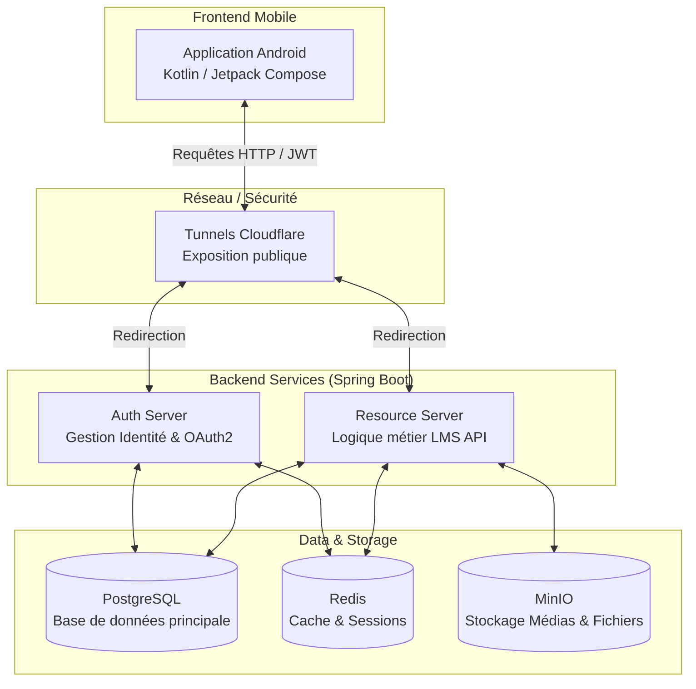

# Plateforme E-Learning - Groupe 6

## Membres de l'équipe
- [Prénom et Nom 1]
- [Prénom et Nom 2]
*(Veuillez remplir avec les vrais noms de votre équipe)*

## Description du projet et fonctionnalités principales
Ce projet est une plateforme complète d'E-Learning orientée mobile, permettant aux utilisateurs de découvrir, suivre et compléter des formations interactives.

### Fonctionnalités principales :
- **Authentification et Profil :** Inscription, connexion, et gestion de profil sécurisée (via un serveur d'authentification OAuth2).
- **Catalogue et Recherche :** Exploration des formations par catégories, recherche textuelle, et recommandations.
- **Suivi d'apprentissage (Mes formations) :** Reprise rapide des cours, suivi précis de la progression par module et par session.
- **Lecteur de cours interactif :** Visionnage de vidéos natives, accès aux ressources téléchargeables, et interface de type "tabs" (Leçons, Fichiers, Q&A).
- **Certifications :** Déverrouillage et téléchargement des certificats de complétion en format PDF.
- **Favoris et Notifications :** Mise en favoris des cours intéressants et centre de notifications.

## Architecture du projet

L'architecture est construite autour de microservices déployés avec Docker, et communiquant avec un client Android natif.



## Dépendances et Prérequis
Afin de faire tourner le projet localement, voici les outils nécessaires :

### Frontend (Android)
- **Android Studio** (dernière version recommandée)
- **JDK 17** (utilisé pour la compilation de l'application)
- Un émulateur ou appareil Android (API 24 minimum)

### Backend (Infrastructure)
- **Docker** et **Docker Compose** (pour instancier la base de données, le stockage et les serveurs Spring)
- **Java 17** (si vous souhaitez lancer les serveurs manuellement sans Docker)

## Instructions de lancement

1. **Démarrer les services Backend :**
   Ouvrez un terminal à la racine du projet et exécutez la commande suivante pour tout lancer via Docker :
   ```bash
   docker-compose up -d
   ```
   *(Attendez que les containers `postgres`, `redis`, `minio`, `auth-server` et `resource-server` soient prêts).*

2. **Démarrer l'application Android :**
   - Ouvrez le dossier `elearning-android` dans Android Studio.
   - Laissez Gradle se synchroniser.
   - Cliquez sur le bouton "Run" (ou `Shift + F10`) pour déployer l'application sur votre appareil/émulateur.

## Captures de l'application

*(Remplacer ces placeholders par de véritables captures d'écran. Vous pouvez glisser-déposer vos images dans le fichier README.md si votre éditeur le permet, ou les lier depuis un dossier d'assets).*


